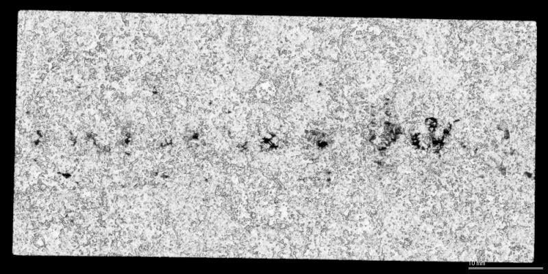

# AnalysisOfImageSemantic

2018学年图像语义分析实验代码

### 实验要求

#### 实验一

隐写术是一种关于信息隐藏的技术，通常利用位图的RGB三种颜色值（0~255）在微小改变的情况下难以被人眼察觉的特点。每种颜色值都可以用8位二进制来表示，而最低有效位LSB技术就是通过修改最低几位的数值来将信息嵌入到图片中去。 
详见WiKi：<https://en.wikipedia.org/wiki/Steganography

#### 实验二

用最大灰度投影（MIP）是临床上最常见的一种血管成像方式，请自己动手写一个将三维数据投影到X,Y，Z三个平面的程序。提交：代码和3张输出图像

#### 实验三

请对钢铁表面缺陷检测图像进行几何校正，分割出其中的缺陷区域，并将分割出的缺陷区域叠加在未分割图像上，并要求计算出缺陷区域的面积。提交：实验报告，过程，代码和图像

### LICENSE

Apache License
Version 2.0, January 2004
http://www.apache.org/licenses/

​	

